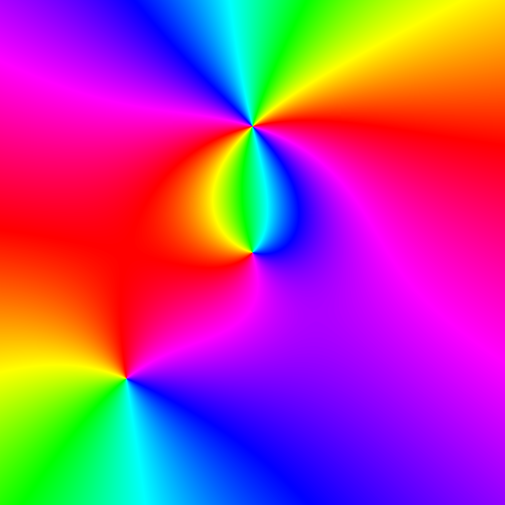
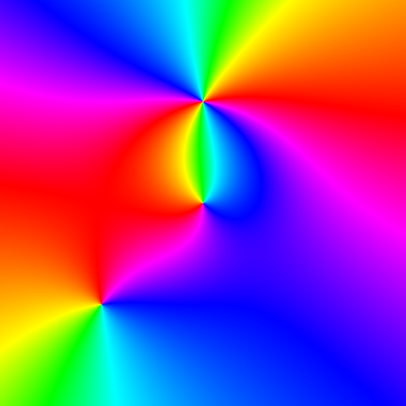
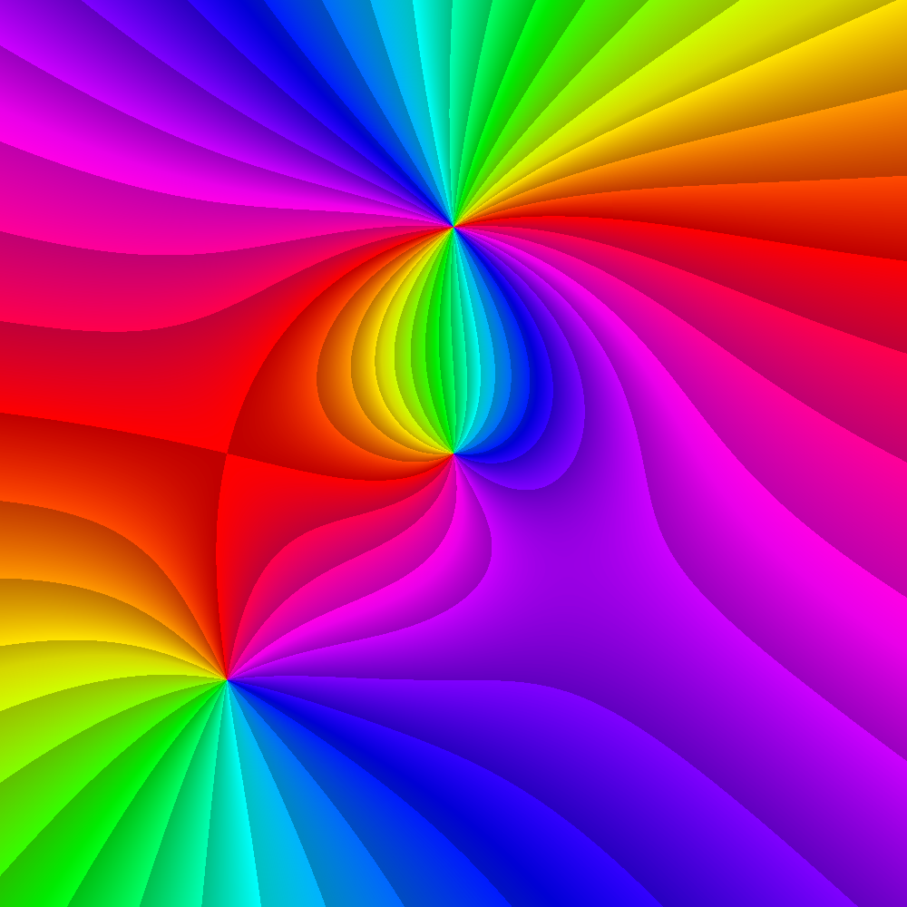

# ComplexPhasePortrait.jl

[](https://travis-ci.org/JuliaHolomorphic/ComplexPhasePortrait.jl)

This package is a [Julia](http://julialang.org) implementation of the phase portrait ideas presented in Elias Wegert's book "[Visual Complex Functions](http://www.visual.wegert.com)".

## Installation

This package is registered, so you can install it as any other Julia package: from the command line, type `]` to go into Pkg mode, and type `add ComplexPhasePortrait`.

## Examples

There is so far one exported function, `portrait`, and here I will try to detail its use. First we need function data over a grid.
```julia
using ComplexPhasePortrait

nx = 1000
x = range(-1, stop=1, length=nx)
Z = x' .+ reverse(x)*im

f = z -> (z - 0.5im)^2 * (z + 0.5+0.5im)/z
fz = f.(Z)
```

Now a basic phase plot. This will display itself on notebooks; to show the image at the REPL or on IDEs, install the `ImageView` package and do `imshow(img)`.
```julia
img = portrait(fz)
```


Now for a basic plot using [NIST coloring](http://dlmf.nist.gov/help/vrml/aboutcolor).
```julia
img = portrait(fz, ctype="nist")
```


Lines of constant phase are given by
```julia
img = portrait(fz, PTstepphase)
```


Lines of constant modulus are given by
```julia
img = portrait(fz, PTstepmod)
```


Finally, a conformal grid is given by
```julia
img = portrait(fz, PTcgrid)
```

