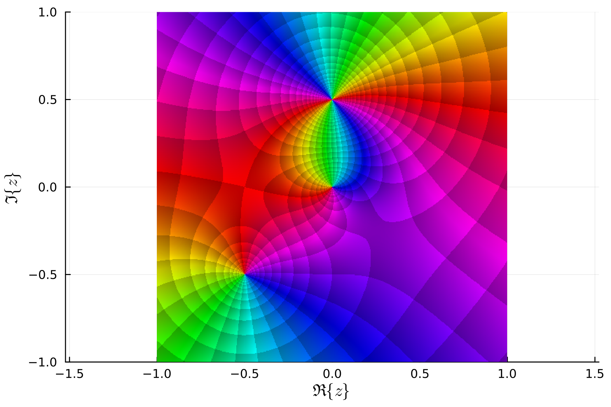
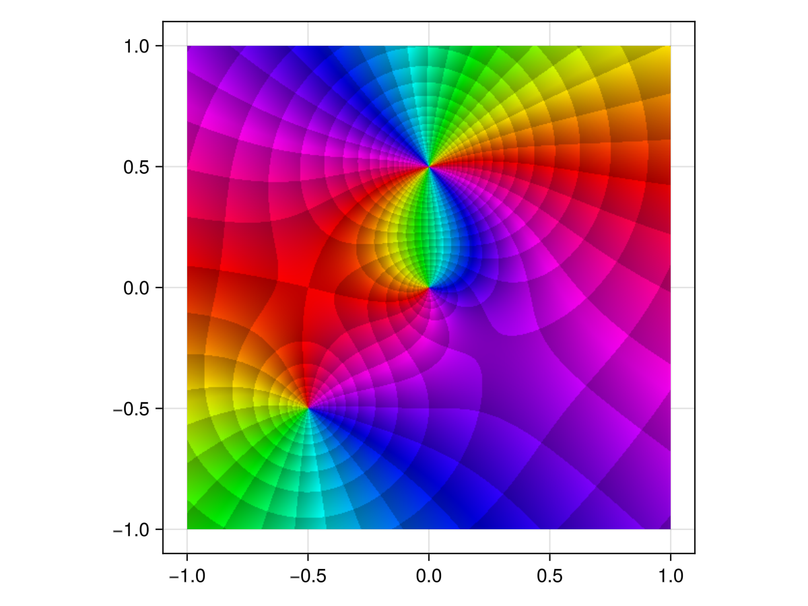

# ComplexPhasePortrait.jl

[](https://github.com/JuliaHolomorphic/ComplexPhasePortrait.jl/actions)
[](https://codecov.io/gh/JuliaHolomorphic/ComplexPhasePortrait.jl)

This package is a [Julia](http://julialang.org) implementation of the phase portrait ideas presented in Elias Wegert's book "[Visual Complex Functions](http://www.visual.wegert.com)".

## Installation

From the Julia command prompt:
```julia
Pkg.clone("git://github.com/JuliaHolomorphic/ComplexPhasePortrait.jl.git")
```

## Examples

There is so far one exported function, `portrait`, and here I will try to detail its use. First we need function data over a grid.
```julia
using ComplexPhasePortrait

nx = 1000
x = range(-1, stop=1, length=nx)
Z = x' .+ reverse(x)*im

f = z -> (z - 0.5im)^2 * (z + 0.5+0.5im)/z
fz = f.(Z)
```

Now a basic phase plot.
```julia
img = portrait(fz)
```


Now for a basic plot using [NIST coloring](http://dlmf.nist.gov/help/vrml/aboutcolor).
```julia
img = portrait(fz, ctype="nist")
```


Lines of constant phase are given by
```julia
img = portrait(fz, PTstepphase)
```


Lines of constant modulus are given by
```julia
img = portrait(fz, PTstepmod)
```


Finally, a conformal grid is given by
```julia
img = portrait(fz, PTcgrid)
```


## Plot recipes

ComplexPhasePortrait.jl has support for plotting recipes for
[Plots.jl](https://github.com/JuliaPlots/Plots.jl).

### Plots.jl:
```julia
using Plots
using LaTeXStrings

using ComplexPhasePortrait
using IntervalSets

f = z -> (z - 0.5im)^2 * (z + 0.5+0.5im)/z

phaseplot(-1..1, -1..1, f, PTcgrid, :ctype=>"nist";
          xlabel=L"\Re\{z\}", ylabel=L"\Im\{z\}")
```


### Makie.jl

Makie.jl is an optional dependency via package extensions, and the
functionality to plot phase portraits becomes available if Makie.jl or
one of its front-end packages is loaded before
ComplexPhasePortrait.jl:

```julia
using GLMakie

using ComplexPhasePortrait
using IntervalSets

f = z -> (z - 0.5im)^2 * (z + 0.5+0.5im)/z

fig = Figure()
ax = Axis(fig[1, 1], aspect=1)
phase!(ax, -1..1, -1..1, f, portrait_type=PTcgrid, ctyle="nist")
display(fig)
```


Alternatively, one can use the function `phase`:
```julia
phase(x, y, f; kwargs...)
```

`x` and `y` can be vectors or `ClosedInterval`s; in the former case
`f` can be a matrix of appropriate size or a `Function`, in the latter
case, only a `Function` is possible.
